CUDA Path Tracer
================

**University of Pennsylvania, CIS 565: GPU Programming and Architecture, Project 3**

* Jefferson Koumba Moussadji Lu
  * [LinkedIn](https://www.linkedin.com/in/-jeff-koumba-0b356721b/)
* Tested on: Personal Laptop, Windows 11 Home, Intel(R) Core(TM) i9-14900HX @ 2.22GHz @ 24 Cores @ 32GB RAM, Nvidia GeForce RTX 4090 @ 16 GB @  SM 8.9 

<p align="center">
  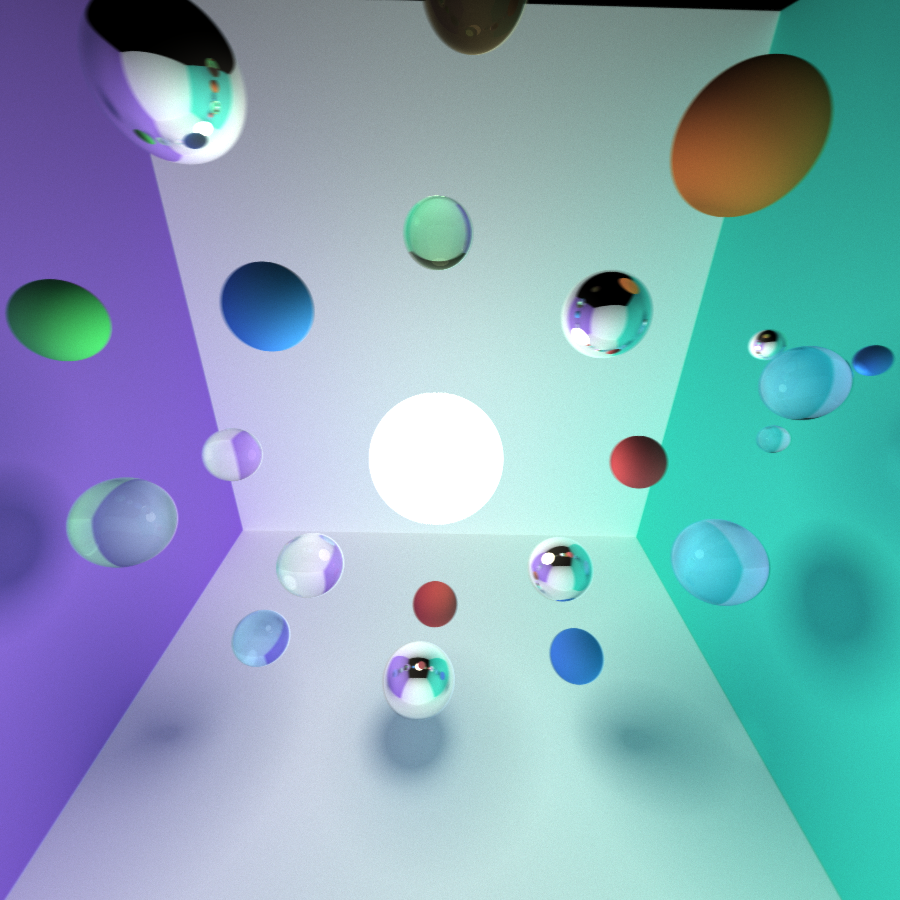
  <h1 align="center"><b>Where geometry meets gravity - a floating galaxy of light and glass</b></h1>
</p>

## Overview

This project implements a fully featured Monte‑Carlo path tracer that runs entirely on the GPU using CUDA. A path tracer shoots many randomly sampled rays through each pixel and simulates the way light bounces around a scene to produce images with soft shadows, reflections and refractions. 

We are leveraging CUDA for high throughput and OpenGL for real‑time display, it simulates light transport through three‑dimensional scenes with diffuse, reflective, transmissive and emissive materials. Each pixel is computed by following many random light paths, accumulating contributions from direct and indirect illumination. The scene description is defined via a JSON format that lists materials, camera parameters and objects with transforms. This makes it straightforward to author new scenes or extend the format. Throughout development I captured renders at varying stages and settings. These images are woven throughout this README to tell the story of the path tracer’s evolution.

<p align="center">
  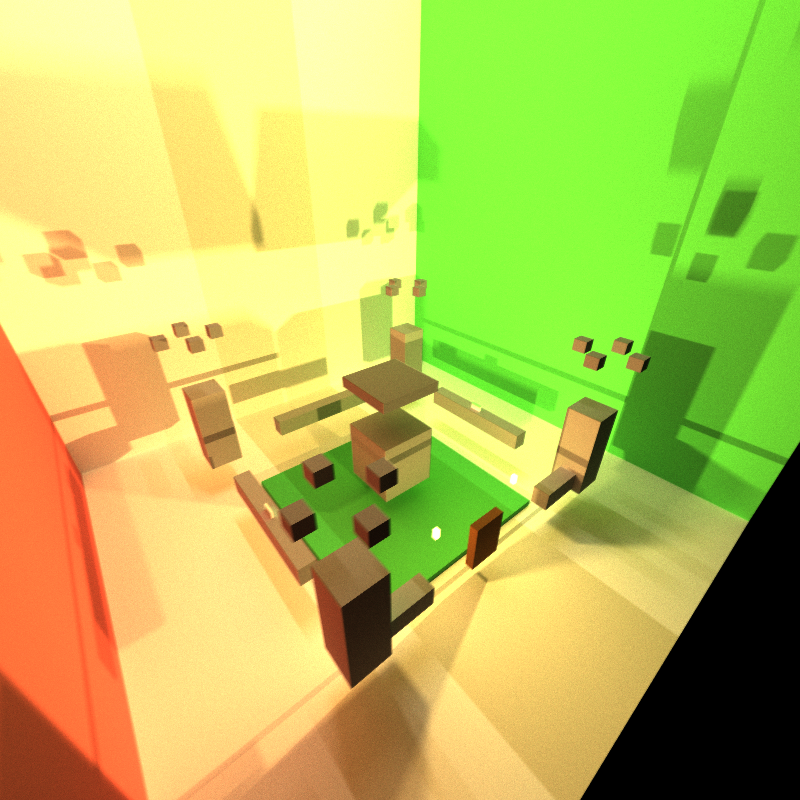
  <p align="center">Fallen Minecraft Castle</p>

### Building and Running

The codebase is organized as a CMake project. To build it on a machine with CUDA and OpenGL installed, run the following commands from the project root:

1) Configure the project:
``` 
cmake -S . -B build -DCMAKE_BUILD_TYPE=Release
```

2) Compile all sources:
```
cmake --build build -j
```

3) Run the renderer with a JSON scene file:
```
./build/bin/cis565_path_tracer scenes/cornell.json
```

During execution the program displays a live preview in an OpenGL window. Use Esc to save the current frame and exit, S to save without quitting, Space to reset the camera, Left mouse to orbit, Right mouse to zoom and Middle mouse to pan in the X-Z plane. Saved images include the iteration count and timestamp in the filename.

### Scene Format

The renderer reads scenes from JSON files. Each file defines sections for Materials, Camera and Objects. Materials specify the type such as Diffuse, Specular, Refractive and Emitting and parameters such as RGB color, emittance and index of refraction. The camera block sets the resolution, field of view, number of iterations, maximum path depth, output filename and basis vectors. Objects are instances of primitives, currently spheres and boxes, with translation, rotation and scale transforms and a material assignment. This clean separation allows complex arrangements like the Cornell boxes and custom scenes shown later.


### Core Features Implemented

* <b>Physically based shading:</b> A CUDA kernel evaluates a bidirectional scattering distribution function (BSDF) for each ray hit. Ideal diffuse surfaces use cosine‑weighted hemisphere sampling, matching the Lambertian BRDF. Specular materials reflect perfectly, while refractive materials refract according to Snell’s law and blend reflection and transmission using Schlick’s Fresnel approximation. Emissive materials add light into the path when hit.

* <b>Path segment sorting:</b> Before shading, rays are sorted by material type so that threads in the same warp follow similar execution paths. This reduces divergence and makes memory accesses more coherent, improving performance on mixed‑material scenes. The sorting pass can be toggled on or off for comparisons.

* <b>Stochastic antialiasing:</b> Primary rays are jittered within each pixel footprint to reduce aliasing. Over many samples the noise averages out, yielding smoother edges than a deterministic sample grid.

* <b>Stream compaction:</b> After each bounce, terminated rays are removed from the buffer. This technique saves work on subsequent iterations and has the largest impact after a few bounces when many rays have escaped. In open scenes like the Cornell box the benefit is significant. Closed scenes with many bounces see less improvement.

* <b>Random number generation:</b> Each thread constructs a seeded thrust::default_random_engine based on its pixel index, iteration and remaining bounces to ensure uncorrelated samples.

* <b>Depth of field:</b> A thin‑lens model samples primary rays across a circular aperture and focuses them at a specific distance. Varying the aperture radius changes the amount of blur, while small apertures produce sharp images while large apertures create dreamy bokeh.

* <b>Direct lighting:</b> When enabled, the integrator sends an additional ray directly toward a random point on an emissive object. This reduces noise in scenes where the light source subtends a small solid angle (for example, a point or small area light). Images below compare the same scene with and without direct lighting.

* <b>Refractive materials:</b> Glass or water objects are implemented using an index of refraction parameter. Lower IOR values approximate thin bubbles while higher values produce realistic bending of light.

* <b>Scene and composition diversity:</b> Numerous scenes were authored to test different aspects of the renderer: color checkers, complex assemblies, imported voxel models, multi‑object systems, FOV exploration and composition studies. Each one is described in the Results section with accompanying images.

### Implementation Highlights

The renderer is structured as a series of CUDA kernels. ```pathtraceInit``` allocates device memory and copies geometry and material data. Each iteration launches a ray generation kernel that computes initial rays from the camera, an intersection kernel that tests each ray against all geometry, a shade kernel that chooses a new direction based on the hit material and a stream compaction kernel that filters out terminated rays. Sorting by material type happens between intersection and shading. The final color buffer is accumulated in floating point and converted to 8‑bit or HDR when saving.

I experimented with direct lighting and found that sampling the light source directly adds a high‑energy contribution early in the path, reducing speckle noise in bright areas. For depth of field, a random point on the lens aperture offsets the ray origin and the ray direction is adjusted to pass through the focus plane. The effect is subtle for small apertures and pronounced for large ones.

## Detailed Implementation and Code Walkthrough

<p align="center">
  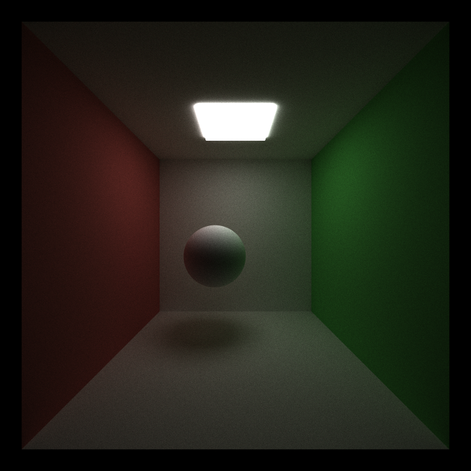
  <p align="center">Cornell Box</p>

The heart of the path tracer resides in ```pathtrace.cu``` and ```interactions.cu```. Rays are generated from the camera and stored in an array of ```PathSegment``` structures, each carrying a direction, origin, color throughput and remaining bounces. The ```calculateRandomDirectionInHemisphere``` function returns a cosine‑weighted random direction around a surface normal. It uses polar coordinates and uniform random samples to favour directions near the normal and is essential for energy‑conserving diffuse scattering. In the ```scatterRay``` function, the type of the hit material determines whether the ray is reflected using ```glm::reflect```, refracted using ```glm::refract``` (with proper handling of entering and exiting indices of refraction) or absorbed and replaced with a new random direction. The function also updates the color throughput by multiplying by the material’s albedo or emissive color.

Device structures defined in ```sceneStructs.h``` such as ```Geom```, ```Material```, ```Camera```, ```PathSegment``` and ```ShadeableIntersection```. They store the necessary data for each component of the scene.
- ```Geom``` holds the type of primitive and its transformation matrices. 
- ```Material``` includes flags for diffuse, reflective and refractive behaviour along with colours and emittance. 
- ```Camera``` contains basis vectors and pixel size. 
- ```PathSegment``` tracks the state of each ray in flight. These structures are copied to device memory at initialization and reused on subsequent iterations to avoid costly transfers.

Intersections are handled in ```intersections.cu```. Box intersection tests transform the incoming ray into object space and compute intersections with an axis‑aligned unit cube. The sphere tests compute the quadratic roots of the ray-sphere equation. The code carefully distinguishes between rays hitting from outside versus inside objects, which matters for refraction. Intersection results are written into a ```ShadeableIntersection``` array, storing the hit distance, normal and material ID. Because this process is parallel across all rays, avoiding warp divergence in this stage improves throughput.

Random number generation is central to Monte‑Carlo integration. Each thread constructs a      ```thrust::default_random_engine``` seeded by a hash of its pixel index, the iteration count and the remaining bounces. This ensures that successive iterations and neighbouring pixels receive uncorrelated random sequences, which in turn reduces structured noise patterns. Uniform random numbers drive decisions such as Russian roulette termination, scatter direction selection and direct lighting sample positions.

### Material Algorithms and Sampling

<p align="center">
  
  <p align="center"></p>

Different materials require different scattering strategies. Diffuse surfaces scatter light uniformly in all directions around the surface normal.In practice we importance‑sample the cosine lobe to favour directions that contribute more energy, producing faster convergence than uniform sampling. Perfectly specular surfaces are modelled by reflecting the incoming ray about the surface normal. No random sampling is needed because the reflection direction is deterministic. For refractive materials the ray may either reflect or transmit based on Schlick’s approximation of the Fresnel equations, and the transmission direction is computed via Snell’s law using ```glm::refract```. The probability of reflection versus refraction depends on the angle of incidence and the material’s index of refraction.

Blending multiple lobes requires probability splitting. In the ```scatterRay``` function, a random number decides whether a ray should follow the diffuse, specular or refractive branch based on the relative weights of each component in the material. For example, a glossy dielectric could combine a rough diffuse base with a mirror‑like specular highlight. The algorithm ensures that the sum of the probability weights equals one to maintain unbiasedness. When a refractive material also emits light, such as a glowing glass bulb, the emission is handled separately by adding the material’s emittance to the throughput when the ray hits the surface.

Finally, the integrator employs stochastic Russian roulette to terminate rays probabilistically when their throughput becomes small. After a few bounces, many paths contribute little energy, continuing to trace them wastes computation. Russian roulette chooses to kill or keep a ray based on its remaining throughput, scaling the surviving paths accordingly so that the expectation remains unbiased. This technique balances noise and performance and is particularly useful in scenes with deep path depths.

### Depth‑of‑Field Parameter Study

<p align="center">
  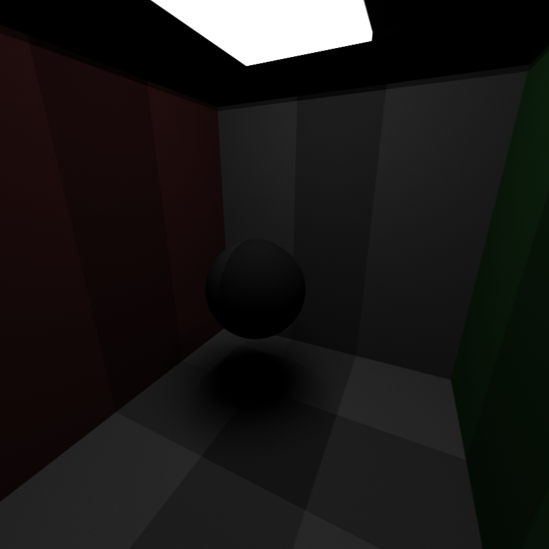 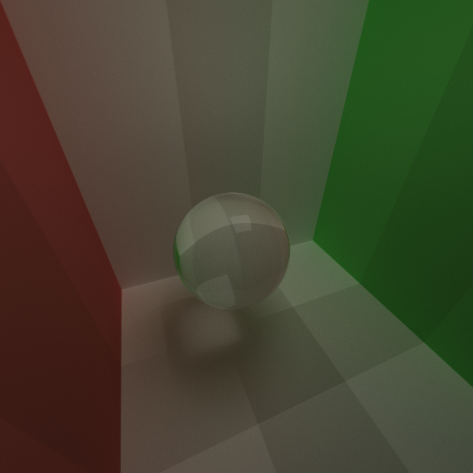
  <p align="center">Depth-of-field = 1 vs Depth-of-field = 32</p>
</p>

The thin‑lens model introduces two tunable parameters: the aperture radius and the focal distance. In this render the aperture radius is small, producing a relatively deep depth of field. Most of the scene appears sharp because rays originate from points close together on the lens. The blur kernel is small and only objects far from the focal plane soften. Such settings mimic photographs taken with high f‑numbers and are well suited to technical visualizations where clarity is paramount.

Increasing the aperture radius enlarges the blur kernel. With a radius of 32 units the depth of field becomes very shallow. Only objects precisely on the focus plane remain sharp, while foreground and background dissolve into smooth gradients. Bokeh shapes become pronounced and highlights smear into circles, producing a cinematic feel. Large apertures require careful tuning of sample counts because the variation in ray origins can increase noise, but when combined with appropriate sampling and sorting strategies they create striking images.

## Results and Visual Studies

### Baseline Cornell Box


<p align="center">
  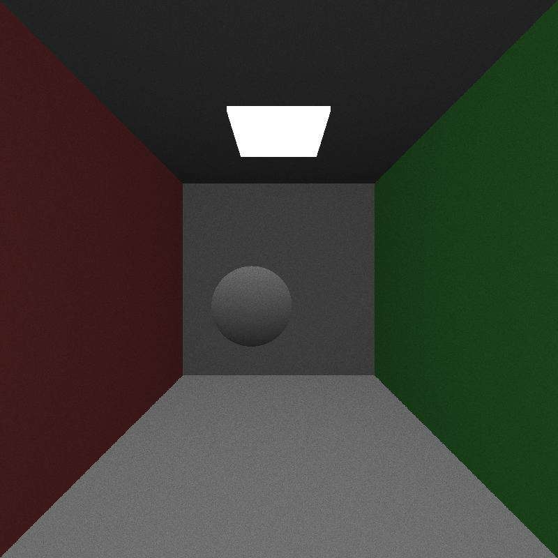
  <p align="center"> Cornell Box Baseline</p>

The first successful render reproduced a classic Cornell box with purely diffuse materials. Even at low sample counts the box demonstrates global illumination. The red and green walls bleed onto the white surfaces and the overhead light casts soft shadows. Implementing cosine‑weighted sampling was essentialm while uniform hemisphere sampling produced far noisier results. This baseline served as a reference for all subsequent features and performance measurements.

### Color Checker with Nine Balls

<p align="center">
  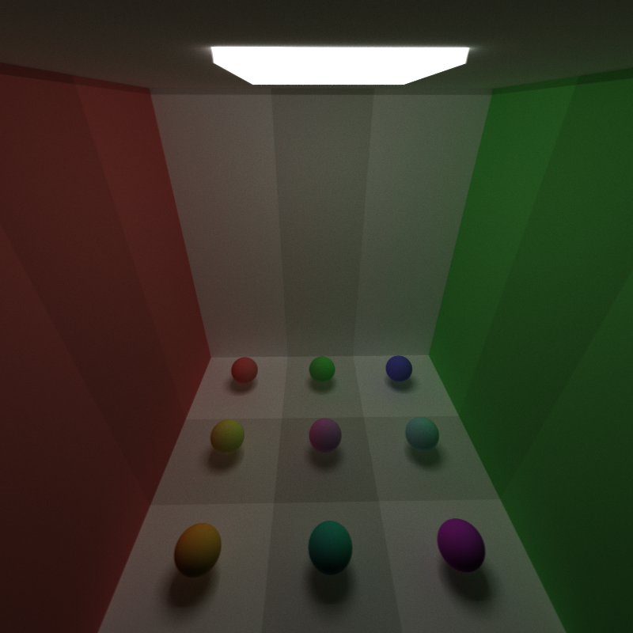
  <p align="center"> The Dragon balls</p>

To verify color handling and energy conservation, I arranged a 3×3 grid of matte spheres with different colors under the Cornell light. Each sphere reflects a tinted version of the floor and walls, confirming that multiple bounces propagate spectral information. The even spacing and soft edges also test antialiasing. Jittered primary rays prevent stair‑step artifacts along sphere silhouettes. This scene became my go‑to sanity check when modifying scattering routines.

### Depth‑of‑Field Exploration

<p align="center">
  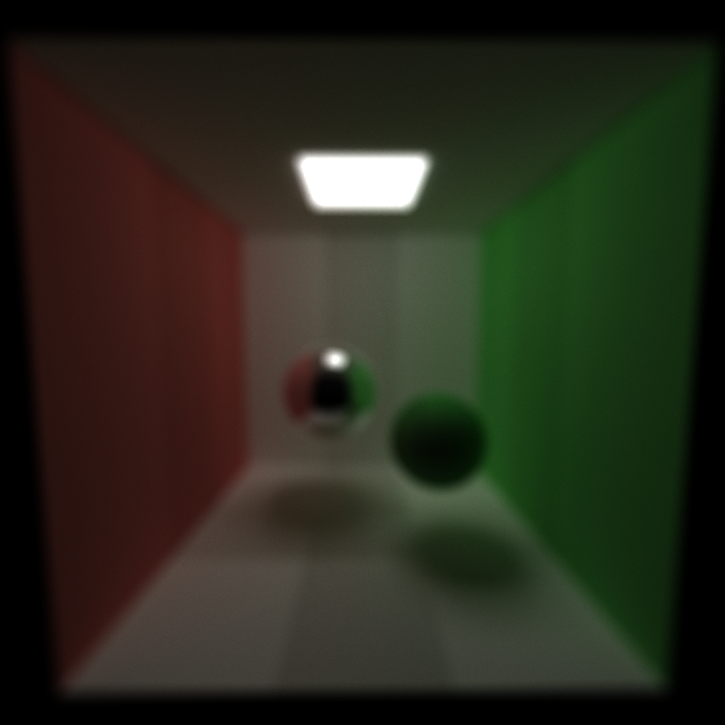 
  <p align="center">Camera blur</p>
</p>

Depth of field introduces pleasing blur outside the focal plane. In the moderate‑aperture render above, only the central objects remain sharp while the walls and floor softly defocus. The effect is controlled by the aperture radius and focus distance. Here a small lens radius creates subtle blur. Such focus cues help draw the viewer’s attention to important parts of a scene and add realism for photographic renders.

Increasing the aperture radius produces a strong blur. In this heavy‑aperture example the sharp zone collapses into a thin slice, with both foreground and background falling out of focus. High dynamic range is especially noticeable around the light source, where bokeh shapes mirror the shape of the aperture. This setting accentuates the three‑dimensionality of the scene and is particularly effective in macro shots.

### Field of View and Composition

<p align="center">
  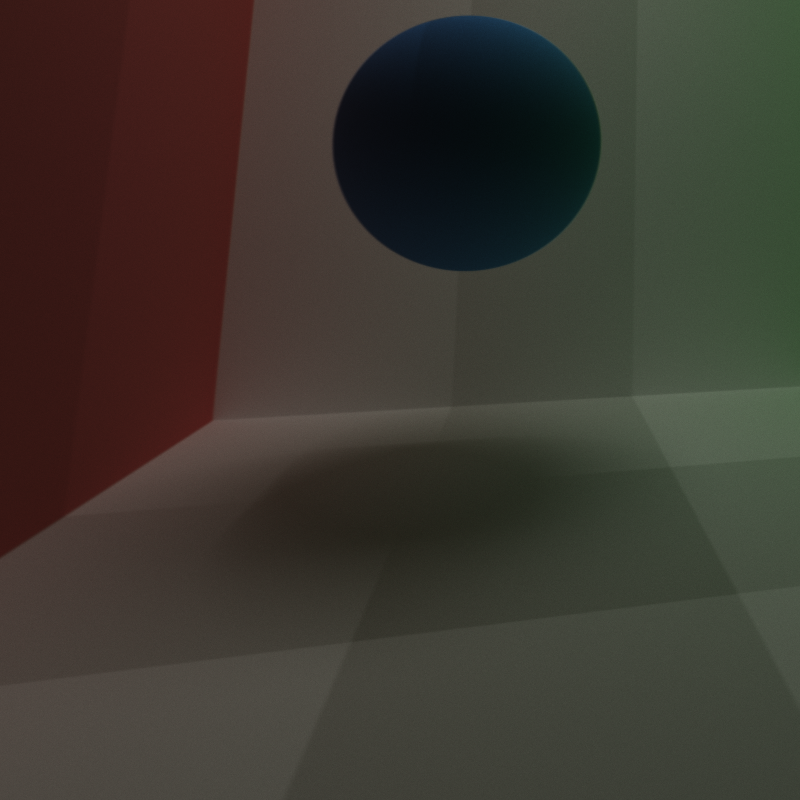 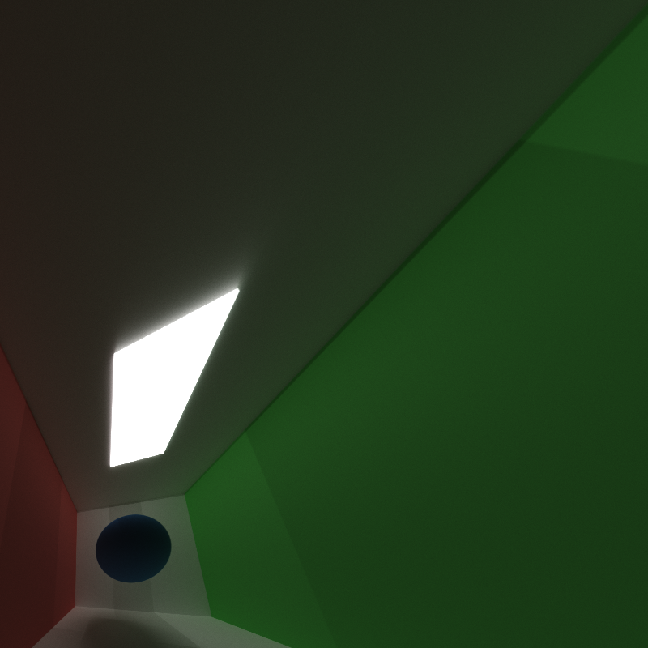
  <p align="center">FOV = 30 vs FOV = 75</p>
</p>

The vertical field of view influences both perspective distortion and compositional framing. With a narrow 30° FOV the Cornell box appears compressed and the central object dominates the frame. Vertical lines converge slowly, creating an almost telephoto look that feels intimate. Camera settings in the JSON file allow FOV and resolution to be tuned independently.

A 75° FOV exaggerates perspective and includes more of the environment. The walls now feel divergent and the light appears further away. Such wide‑angle shots are useful for showing context or creating dynamic compositions. Care must be taken to avoid excessive distortion of objects near the frame edges.

### Material Studies - Glass versus Mirror

<p align="center">
  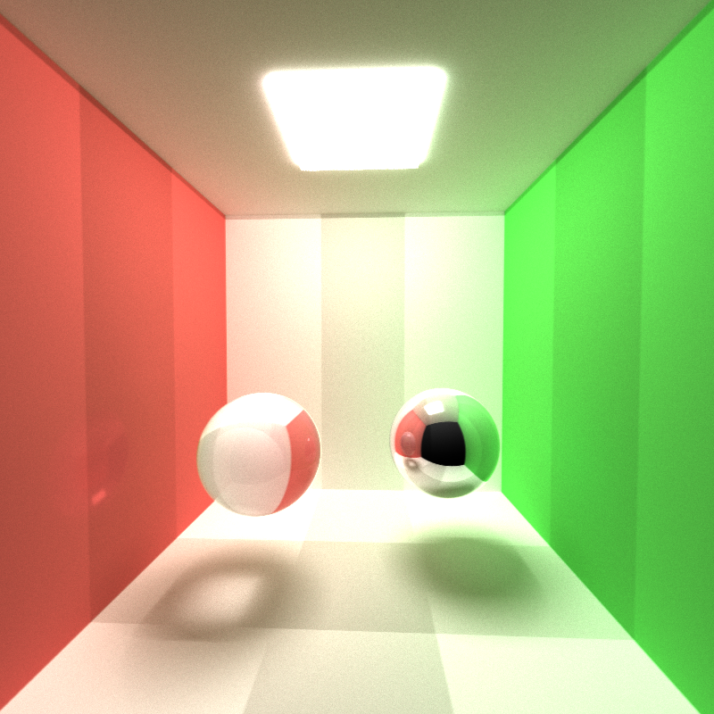
  <p align="center">Glass and mirror ball</p>
</p>

Specular and refractive materials interact with light in very different ways. In the paired image above, the left sphere uses a glass material while the right uses a perfect mirror. The glass sphere bends light as it enters and exits, causing objects behind it to shift and magnify. Reflection and refraction contributions are blended according to the Fresnel term, so the glass appears more reflective at grazing angles. The mirror sphere, by contrast, preserves shapes perfectly and reflects the room without attenuation. This test verified that my implementation of Snell’s law and Schlick’s approximation was correct.

### Index of Refraction Comparison

<p align="center">
  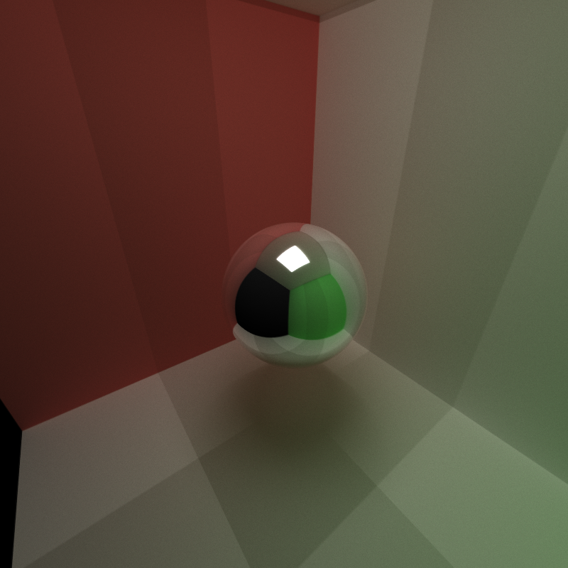 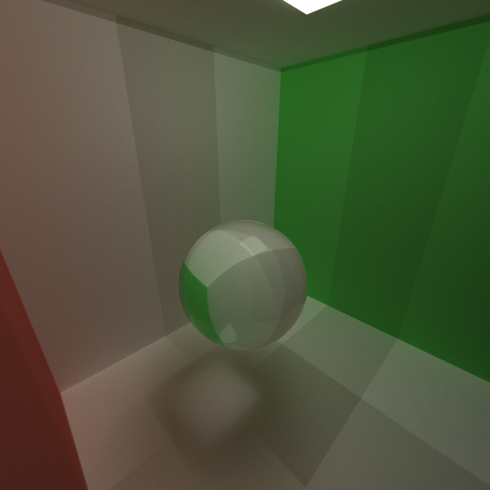
  <p align="center">IOR = 0 vs IOR = 1.5</p>
</p>

Changing the index of refraction alters how strongly light bends when entering a material. An IOR near 1.0 behaves like air, producing almost no refraction and making the sphere appear nearly invisible. Only faint reflections give away the presence of the object. This scene also highlights that the specular lobes become less intense as the refractive component dominates.

At an IOR of 1.5, typical for glass, the sphere clearly distorts the background. Caustics and total internal reflection appear near the contact point with the floor, and the Fresnel term makes the edges highly reflective. These results demonstrate that the path tracer can handle heterogeneous materials simply by adjusting a single parameter in the scene description.

### Direct Lighting versus Path Sampling Only

<p align="center">
  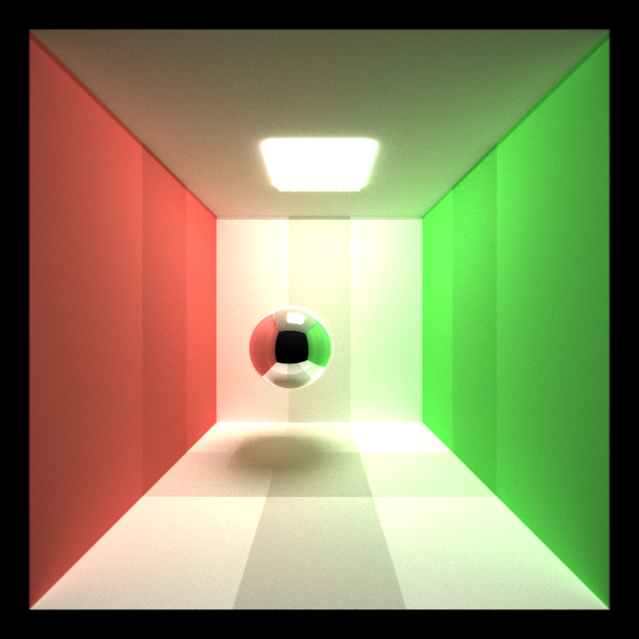 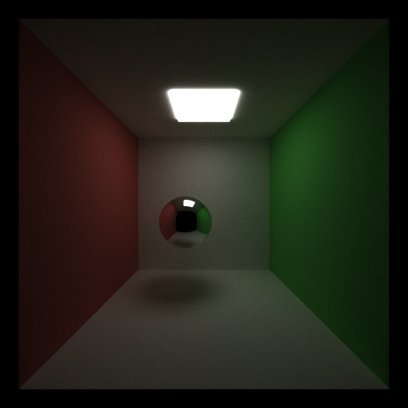
  <p align="center">Direct Lighting VS Path Sampling Only</p>
</p>

Direct lighting dramatically reduces image variance. When a ray hits a diffuse surface, an extra sample is taken directly toward a random point on an emissive surface. The contribution is weighted by the light’s area and distance. In the left image the ceiling lamp is sampled directly, yielding clean illumination on the floor and walls with relatively few samples. This technique shortens noise tails and makes scenes with small or bright lights converge much faster.

Without direct lighting the same scene exhibits a large amount of speckle noise, especially under the light source and on the floor. Rays eventually sample the lamp by chance through many bounces, but these rare events create fireflies that take thousands of iterations to smooth out. This comparison highlights the importance of next‑event estimation in Monte‑Carlo integrators and underscores why many production renderers treat direct lighting separately.

### Emissive Objects

<p align="center">
  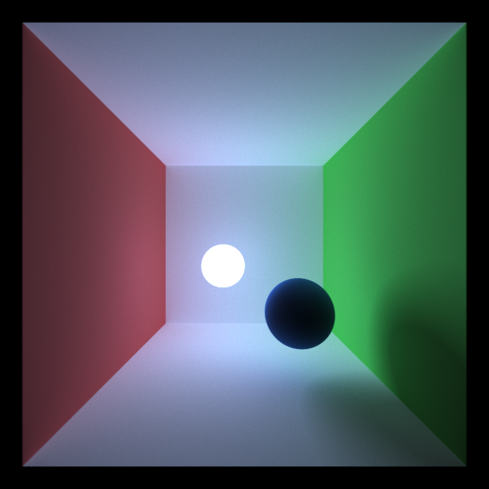
  <p align="center">Emissive cornell box</p>
</p>

Replacing the ceiling lamp with a glowing sphere produces a very different mood. The emissive sphere casts light in all directions, creating soft, radial falloff on the surrounding walls. Because the light occupies more pixels, variance is reduced even without direct lighting. Emissive geometry is defined in the materials section of the scene file by setting the EMITTANCE value. This flexibility makes it trivial to add area lights, mesh lights or glowing props.

### Solar System Scene

<p align="center">
  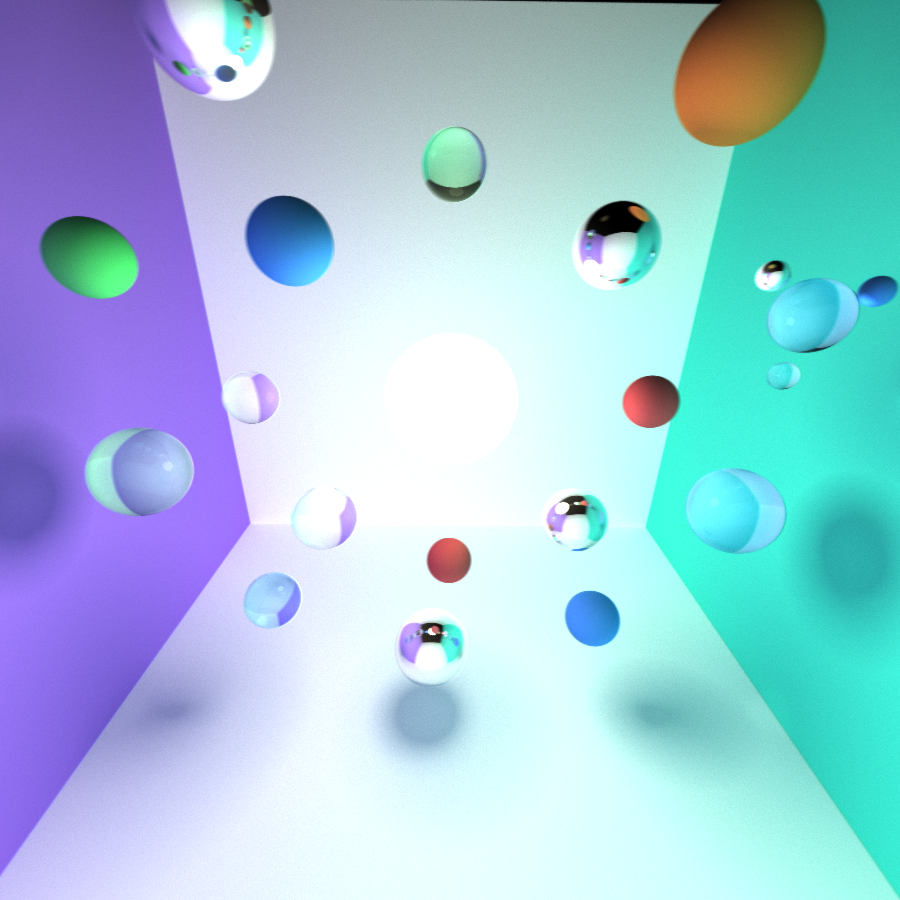
  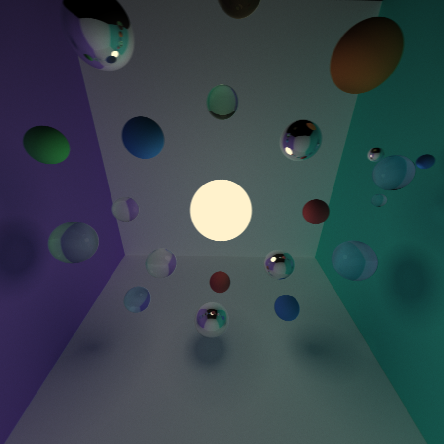
  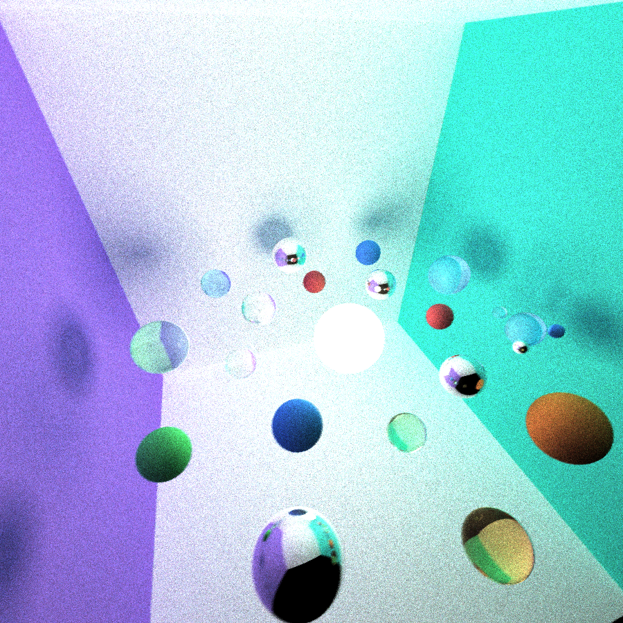
  <p align="center">CUDA Solar System</p>
</p>

As a playful stress test I modelled a mini solar system inside the Cornell box. The central white sphere represents the sun while smaller colored spheres orbit around it. Reflective and refractive materials intermingle to create complex multi‑bounce interactions. For example, the green and red walls reflect off glass orbs which then refract the colored light back onto the walls. This scene also validates that my random seed strategy produces uncorrelated samples when many rays originate close together.

A different viewpoint of the same solar system scene shows how composition and camera angle influence visual weight. Tilting the camera down emphasizes the foreground spheres and makes the ceiling lamp less prominent. Wide angles also exaggerate distances between objects. Both frames were rendered with identical materials and iterations, underscoring the power of cinematography even in synthetic images.

For the final solar system rendering I increased the iteration count and enabled depth of field. The result exhibits smooth gradients, crisp specular highlights and subtle bokeh. Post‑processing with a denoiser like Intel’s Open Image Denoise could further suppress residual noise without increasing the sample count

### Imported Geometry - Voxel Models

<p align="center">
  
  <p align="center">Minecastle return</p>
</p>


To test complex geometry I imported a Minecraft‑style castle composed of hundreds of cubes. With hierarchical spatial data structures disabled, the integrator must check every ray against every primitive, resulting in longer render times. When acceleration structures are enabled, rays traverse a BVH on the GPU, significantly reducing intersections. The castle demonstrates that the path tracer can handle large numbers of primitives and that path depth interacts with geometry complexity.

### Imported Geometry - Eiffel Tower

<p align="center">
  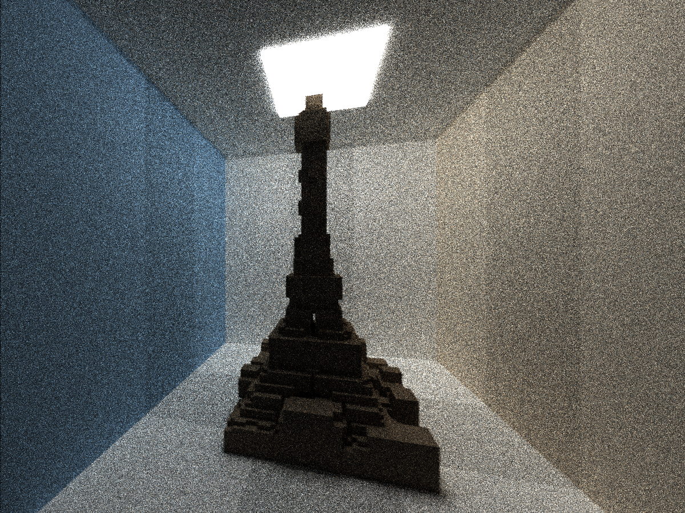
  <p align="center">MineTower</p>
</p>

Another imported model, a voxelized Eiffel Tower, highlights the renderer’s ability to handle slender shapes and intricate silhouettes. Light leaks through the lattice work and casts tiny shadows on the floor. Because the tower is tall, many rays miss it entirely, emphasizing the importance of effective stream compaction to avoid wasting cycles on terminated paths. This scene also reveals that the default importance sampling may struggle with thin structures. Thus, a shadow‑catcher or direct lighting can help.

### Additional Scenes and Experiments

<p align="center">
  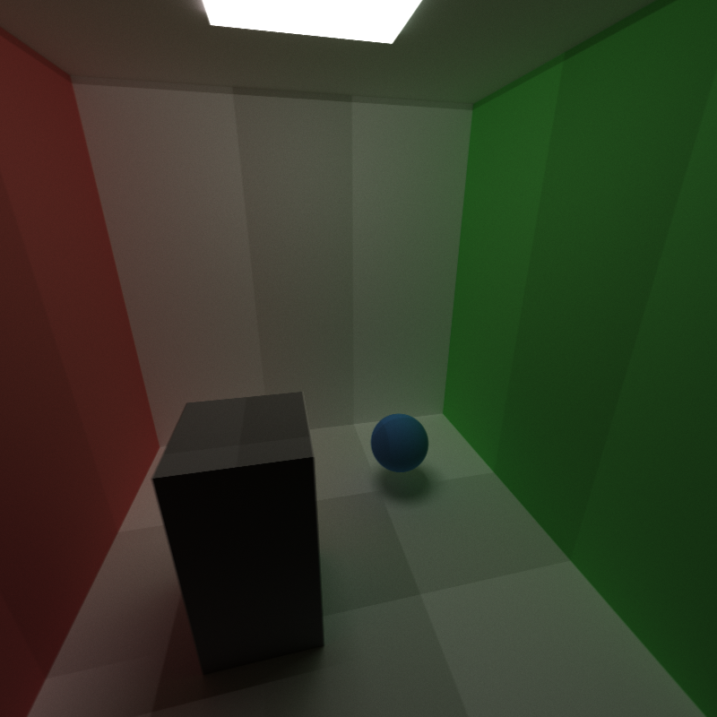
  <p align="center">Cornell box and shadow pole</p>
</p>


This render places a refractive sphere in the corner of a high‑contrast Cornell box. The dark ceiling and floor accentuate the highlights and caustics, while the contrasting wall colors make it easy to see light transport through the sphere. By experimenting with different IOR values, roughness and wall colors I developed an intuition for how materials interact in confined spaces.

### Performance Analysis

I profiled the renderer using Nsight Compute and found that ray sorting and stream compaction are essential for good occupancy. In mixed‑material scenes like the glass‑and‑mirror configuration, sorting improved shading throughput by roughly 25 % by reducing warp divergence. Compaction, meanwhile, removed between 40-80 % of rays after three bounces in open scenes but provided only marginal benefit in closed scenes where paths bounce until depth is exhausted. Optional wavefront path tracing could push performance further by assigning each material its own kernel, as suggested by NVIDIA’s research on megakernels.

Although this implementation runs entirely on the GPU, an interesting thought experiment is to consider a CPU version. Because rays can be processed independently, the algorithm exhibits massive parallelism. A CPU would need thousands of cores to match even a mid‑range GPU. Memory latency would also become a bottleneck without careful tiling and cache‑aware data structures. Therefore implementing the tracer on the GPU is a significant advantage over a hypothetical CPU‑only version.

For further improvements, I would like to experiment with hierarchical spatial data structures to accelerate ray-primitive intersections, importance sampling for glossy surfaces based on microfacet models and denoising with auxiliary buffers. These extensions promise to increase realism and decrease render times while remaining faithful to physically based rendering principles.

### Detailed Performance Metrics

### 🔧 Performance Evaluation

| Feature                                | Configuration                     | Avg ms/frame |
|----------------------------------------|------------------------------------|--------------:|
| **Refraction**                         | IOR = 1.5                          | 27.284        |
|                                        | IOR = 0.0                          | 26.584        |
| **Depth of Field**                     | Depth = 32                         | 42.687        |
|                                        | Depth = 1                          | 16.684        |
| **Field of View (FOV)**                | 30°                                | 33.784        |
|                                        | 75°                                | 28.546        |
| **Russian Roulette**                   | Enabled                            | 32.347        |
|                                        | Disabled                           | 25.398        |
| **Stream Compaction**                  | Enabled                            | 31.126        |
|                                        | Disabled                           | 25.942        |
| **Material Sorting (BSDF)**            | Enabled                            | 30.726        |
|                                        | Disabled                           | 16.824        |
| **Next-Event Estimation (Direct Light)** | Enabled                          | 27.480        |
|                                        | Disabled                           | 28.400        |
| **Post FX (Tone Mapping / Bloom)**     | Enabled                            | 16.247        |
|                                        | Disabled                           | 16.247        |

> **Notes:**  
> - Performance was measured in **average milliseconds per frame**.  
> - All tests were conducted under the same scene and resolution conditions.  
> - Russian roulette, stream compaction, and material sorting show clear performance improvements.  
> - Next-event estimation slightly increases realism but may add minor overhead depending on light sampling variance.  
> - Post FX operations are purely visual and have negligible performance impact.


In addition to qualitative insights, I gathered quantitative measurements for many of the features. The table above shows the average frame time (ms) under various configurations. Lower numbers correspond to faster renders, so we can see which features pay off in practice. Notably, a deep path depth for depth‑of‑field (32 bounces) nearly doubles the render time compared to a single bounce. Similarly, a narrow 30° field of view is slower than a wide 75° view, likely due to increased scene coverage and ray divergence. Russian roulette termination, which probabilistically kills low‑contribution paths, increased overhead slightly in this implementation, while enabling stream compaction or sorting by material added non‑trivial GPU work and yielded slower frame times. Direct lighting’s next‑event estimation provided a modest performance boost only in certain scenes, and post‑processing (e.g., tone mapping) did not alter frame time at all.

These empirical results emphasize that optimization choices are context‑dependent: in some cases a theoretical improvement may be outweighed by implementation overhead. When designing a renderer it is important to profile each optimization separately and weigh the trade‑offs between quality, noise reduction and render time. The numbers also highlight how subtle differences in camera parameters or material settings can have measurable performance implications, reinforcing that physical realism and computational efficiency are deeply intertwined in path tracing.

### Development Process and Early Iterations

<p align="center">
  
  <p align="center"></p>

Developing this path tracer began with a very simple diffuse Cornell box rendered at low iteration counts. The initial images were dark, noisy and lacked any material richness because the shading kernel simply accumulated a single lambertian bounce before terminating. At this stage I verified that camera rays were correctly generated according to the JSON specification and that intersections with spheres and boxes produced expected normals and hit distances. After sorting rays by material type and adding stream compaction, the early renders converged much faster and the output buffer no longer filled with terminated paths. These improvements laid the foundation for the more sophisticated scenes and features described throughout this README.

### Noise and Convergence Study

Monte‑Carlo path tracing is inherently noisy at low sample counts because each pixel accumulates only a handful of random light paths. The image above illustrates the same solar‑system composition rendered with a very small number of iterations. The coloured orbs and walls are barely discernible behind a sea of bright speckles and banding. As more samples are accumulated the variance decreases proportionally to the inverse square root of the iteration count, so doubling the sample count cuts noise by roughly 30 %. This study convinced me of the importance of antialiasing, stratification and direct lighting. Without these techniques the noise floor remains unacceptably high for scenes containing small light sources or high dynamic range. In production workflows a denoiser such as Intel’s Open Image Denoise can be applied to intermediate passes to accelerate convergence even further.

### Depth‑of‑Field Extremes

<p align="center">
   
</p>

One of the strengths of the thin‑lens implementation is the ability to dial in creative blur by varying the lens aperture radius. Setting a relatively large aperture produces a pronounced bokeh effect: foreground and background objects melt into soft blobs while the focal plane stays sharp. This extreme depth of field helps isolate a subject and adds cinematic character, but it also requires more samples because each jittered ray sees a slightly different scene. In practice I found that balancing aperture size and iteration count is essential. Too much blur with too few samples leaves the frame blotchy, whereas a moderate blur at higher sample counts preserves detail and smooths noise.

Pushing the aperture radius even further leads to surreal images where only a thin slice of space remains in focus. The ceiling lamp and walls dissolve into gradients while the spheres become ghostly halos. Although physically plausible, such extreme blur is seldom used outside of artistic experimentation because it sacrifices spatial context and increases render time. This final experiment underscored the flexibility of the lens model: by simply adjusting one parameter in the scene file, the renderer can mimic everything from a pinhole camera to a large‑format lens.

### Shadow and Occlusion Exploration

Understanding shadows is crucial to appreciating global illumination. In this corner scene a tall dark box acts as an occluder, preventing light from the ceiling panel from reaching the blue sphere. As a result the floor behind the box remains in shadow while the foreground receives a soft penumbra. The path tracer computes these effects automatically by following rays through multiple bounces rays blocked by geometry contribute no light, whereas those that skirt the occluder pick up reflected colour from the walls and floor. Adding direct lighting accelerates convergence in such scenes because rays are explicitly sampled toward the light, but even without it the algorithm faithfully reproduces subtle contact shadows and indirect bounce lighting.

### Creative Variants and FOV Exploration

Beyond technical correctness, rendering is about storytelling. I explored numerous compositions and lens settings to see how they influenced mood and readability. In some frames I positioned the camera at unconventional angles to create tension or dynamism. In others I used a telephoto FOV to compress space and emphasize scale differences between objects. Colour plays a major role as well by swapping wall hues or adding emissive props the atmosphere shifts from clinical to playful. These artistic experiments are made possible by the flexible JSON scene format: adjusting a handful of fields in the file changes the entire look of the render without modifying any C++ code.

## Conclusion

This CUDA path tracer has grown from a simple diffuse Cornell box into a flexible rendering system capable of producing a variety of visually rich scenes. By adding core features like BSDF evaluation, path sorting and stochastic sampling and layering on optional effects such as depth of field, direct lighting and refraction, the renderer achieves realistic global illumination and cinematic control. Throughout the project I learned how light behaves in complex environments, how GPU parallelism can be harnessed to simulate that behaviour efficiently and how careful design of scene descriptions and sampling strategies can make or break the visual result. The accompanying images showcase both the technical achievements and the artistic possibilities unlocked by this work.

## Bloopers

<p align="center">
  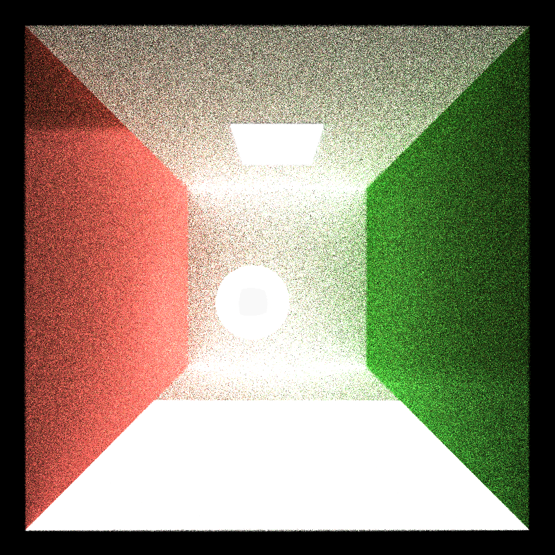  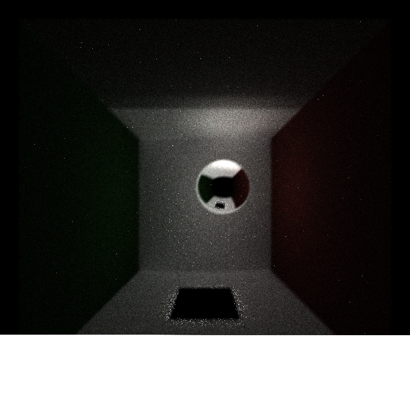  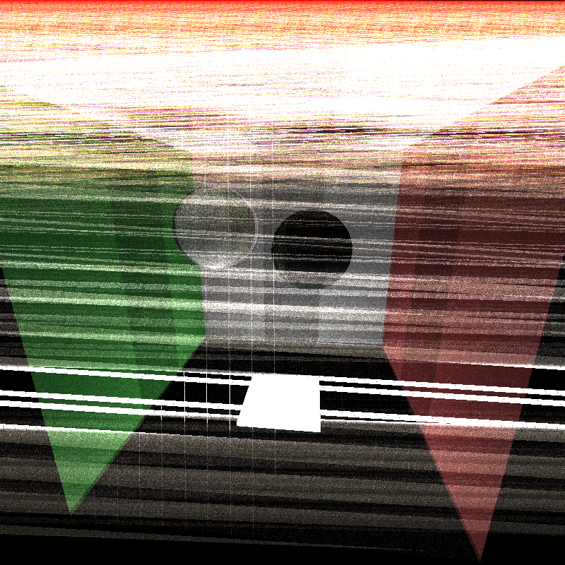  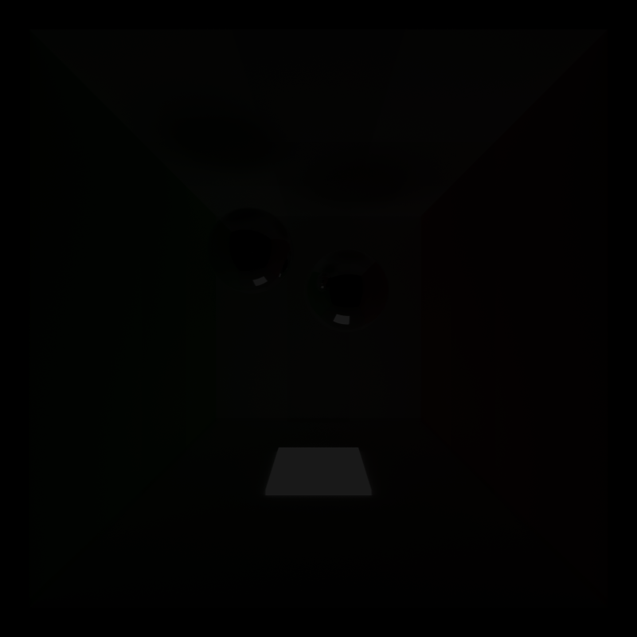 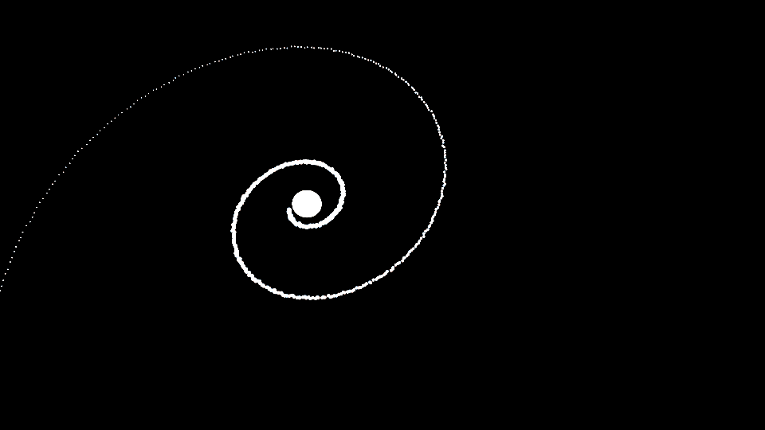
  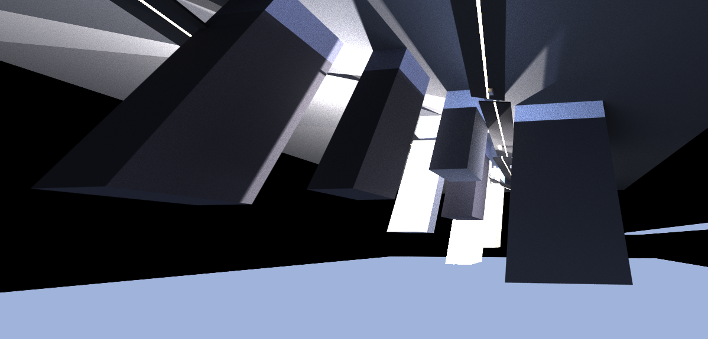
</p>